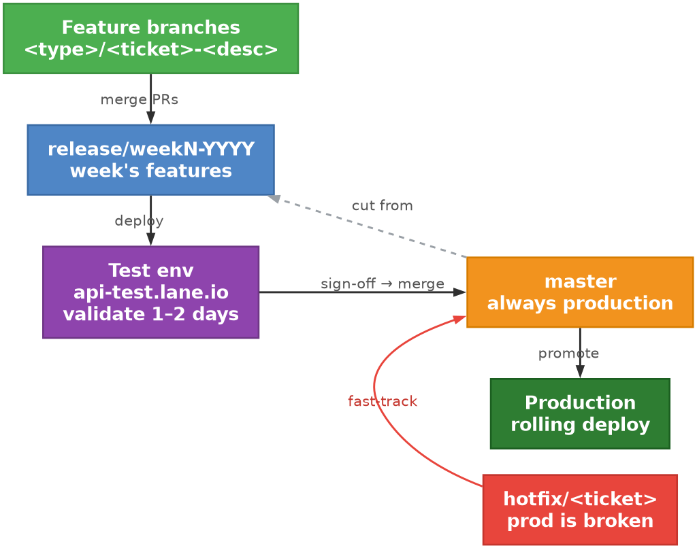
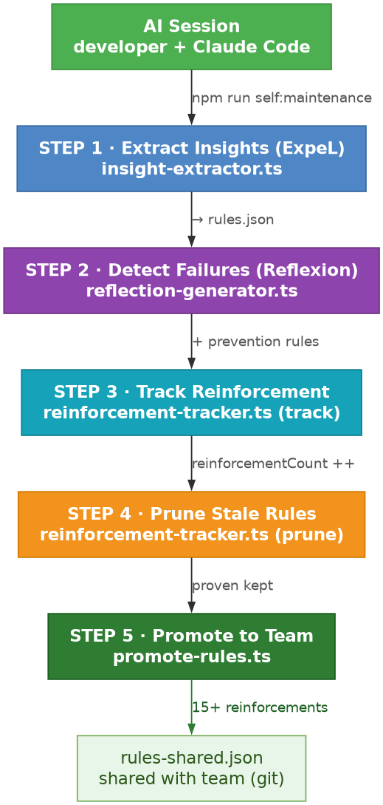
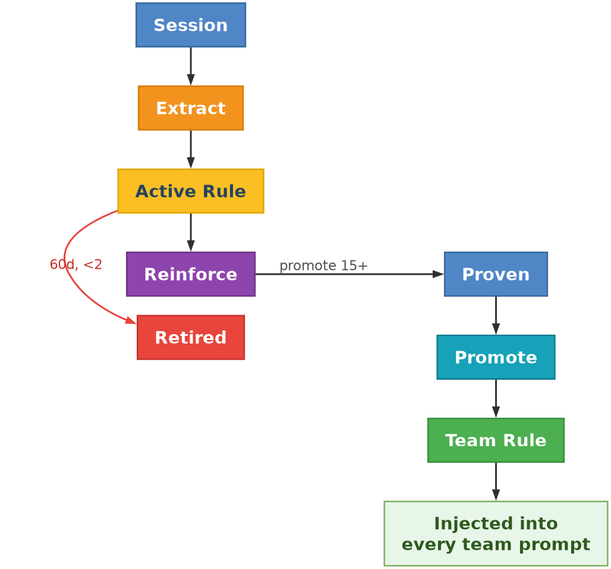
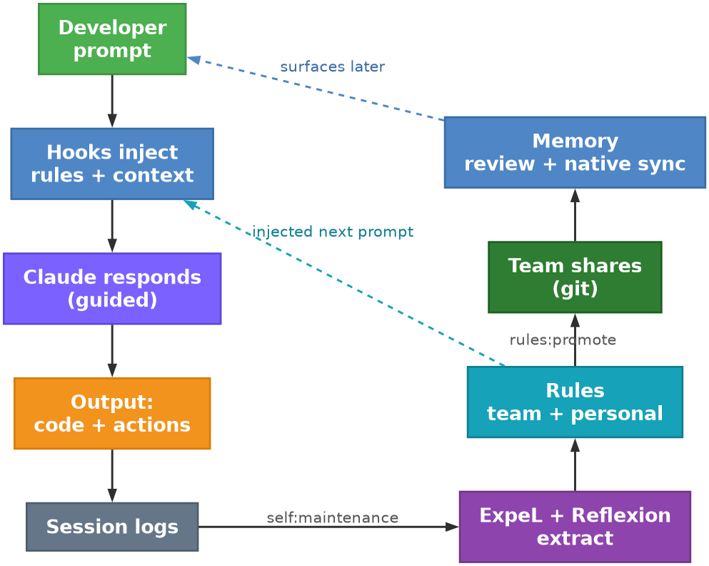

# Tech Stack

---

## Lane AI-First Engineering Protocol (v4.0)

> **What:** An AI-first development framework for all 5 Lane projects. **Why:** Consistent quality, faster shipping, fewer production bugs. **How:** 6 shared AI roles, automated quality gates, self-learning system, and Datadog-driven bug hunting — all orchestrated through the Lane workspace. **Result:** Every developer uses AI the same way. Every PR passes the same gates. The team gets smarter with every session.

> **What changed in v4.0 (synced to workspace, June 2026):** All hooks ported from bash to Node 20+ (`scripts/hooks/*.js`); the three `UserPromptSubmit` hooks consolidated behind a single `user-prompt-dispatcher.js`; rule injection rewritten to Jaccard similarity + Qdrant semantic fallback (top 5, two-tier threshold ≥ 0.05/0.02); rule counts refreshed (116 team / 145 personal); the reliability loop is now the fully-automated Bug Hunter (the manual error-classification role was retired); the `nodejs-debugger` MCP replaced AgentVibes; and the memory model replaced the 3-scope filesystem with the memory-proposal review queue + native memory sync.

---

### 0. What is Lane?

**Lane** is an open-source, phase-based AI development workspace that runs on top of **Claude Code** (Anthropic's CLI). Instead of each developer configuring their own AI setup, Lane provides a shared, pre-configured environment where the entire team works the same way from day one.

**Core Idea:** Lane breaks every task into phases (Analysis → Planning → Implementation → Delivery) and assigns specialized AI agents to each phase. The AI that designs your system is not the same AI that codes it, and not the same AI that reviews it. This separation of concerns catches bugs that a single AI session would miss.

**Key Features:**

| Feature | What It Does |
|---------|-------------|
| **Phase-Based Workflow** | 4 phases (Analysis, Planning, Implementation, Delivery) with automatic handoffs between 10 specialized agents |
| **Smart Routing** | `/work-ticket "task"` auto-detects if it's a bug fix (5 min), feature (15 min), or architecture task (30 min) and selects the right workflow |
| **Slash Commands / Skills** | Core dev workflow: `/work-ticket`, `/spec`, `/breakdown`, `/swarm-implement`, `/bug-hunt`, `/brainstorm`, `/tech-debate`, `/jira-epic`, `/agent`, `/phase`, `/progress`, `/handoff`, `/start-session`, `/add-project`, `/remove-project`, `/pre-push`, `/story-point`, `/verify`, `/design-agent`. Add your own product/ops skills under `.claude/skills/`. |
| **15 Agent Definitions** | In `.claude/agents/`: 10 phase agents (Analyst, Product Owner, Architect, Designer, Tech Writer, Developer, Tester, Reviewer, Deployer, Documenter) + 5 workflow agents (spec-writer, breakdown-planner, implementer, reliability-hunter, verifier). Add project-specific review agents under `.claude/agents/<project>/` when a codebase needs its own standards enforced. |
| **9 MCP Servers** | Context7 (docs), Playwright (browser), Figma (design), Atlassian (Jira), Sequential Thinking (reasoning), Datadog (errors/metrics), AWS CloudWatch (logs), AWS Lambda (functions), Node.js Debugger (runtime inspection) |
| **Multi-Platform Git** | Auto-detects Bitbucket, GitHub, GitLab, or Azure DevOps per project. Discovers PR format from merged PRs. |
| **Self-Learning System** | Consolidated single learning system: rule injection on every prompt via Jaccard similarity (stopword-filtered tokens) with a Qdrant-cached semantic fallback — top 5 rules above a two-tier threshold (strict ≥ 0.05, relaxed ≥ 0.02), project-tagged rules boosted by +0.03. ExpeL + Reflexion extract rules from sessions. Native memory sync bridges high-confidence rules to Claude Code's built-in memory. |
| **8 Hook Events (Node)** | All hooks are Node 20+ (`scripts/hooks/*.js`). PreToolUse (security gate), PostToolUse (audit), UserPromptSubmit (single `user-prompt-dispatcher.js` running context + rules + budget), SessionStart (auto-sync), Stop (telemetry), PreCompact (auto-snapshot), SubagentStop (agent telemetry), Notification (logging) |
| **Session Persistence** | Per-session sidecars (multi-terminal safe) track prompts, cost, lines changed, files touched. `./scripts/fresh-context` saves snapshots. Pre-compact hook auto-saves before context compaction. |
| **Statusline** | Real-time status bar showing context pressure %, prompt count, session cost, git branch, model — with semantic color zones (healthy/warning/critical) and `[COMPACT NOW]` alerts |
| **Native Subagents** | All 10 phase agents migrated to Claude Code native subagents (`.claude/agents/`) with per-agent tool restrictions (reviewer = read-only, developer = full write access) |
| **Jira Epic Support** | `/jira-epic PPT-6691` fetches epic, builds dependency chain, creates branch-per-task with auto PR targeting |
| **Brainstorming Engine** | `/brainstorm "topic"` spawns 6 isolated AI agents (Innovator, Connector, Simplifier, User Advocate, Hacker, Futurist) that brainstorm in parallel, then synthesize |
| **Tech Debate** | `/tech-debate "question"` runs a structured debate between 5 perspectives (Pragmatist, Purist, Skeptic, Operator, Architect) with a Synthesizer |
| **Built-in Skills** | NestJS patterns, Next.js App Router patterns, brainstorming methodology. Custom skills can be added per project. |
| **Project Context Generation** | `./scripts/generate-context <project>` auto-detects tech stack, frameworks, UI libraries. `./scripts/deep-map <project>` does deep analysis (structure, deps, hot files, API surface, test coverage, architecture patterns). |
| **Per-Project CLAUDE.md** | Each project gets generated instructions with its AI persona, commands, quality rules, and learned lessons |
| **Multi-Project Support** | Manage all 5 Lane projects from one workspace. Symlink external repos into `agent/_projects/`. |
| **Lane Code Review Agents** | 4 specialized review agents: architecture (layer violations), security (secrets, injection, auth), performance (N+1, loops, pagination), conventions (logging, JSDoc, complexity). Run via `/review-lane`. |
| **Self-Improvement System** | Auto-extracts rules from every session (116 team rules in `rules-shared.json` + 145 personal in `rules.json`). Team rules shared via git. Personal rules promoted to the team at ≥ 15 reinforcements. Native memory sync (`memory-sync.ts`) writes high-confidence rules to Claude Code's built-in memory. Dashboard for rules, sessions, reflections. |
| **Agent Teams** | Parallel teammate execution for implementation. Spawn multiple AI agents that work concurrently on independent tasks. |
| **Spec-Driven Pipeline** | `/spec` generates a PRD, `/breakdown` creates a wave-based plan, `/swarm-implement` executes tasks in parallel via agent teams. |
| **Rules Dashboard** | Interactive HTML dashboard showing rule effectiveness, session history, and reflection summaries. |

**What Lane is NOT:** Lane is tool-agnostic at the individual level. Developers can still use Cursor, Copilot, or any other AI tool for personal productivity. Lane standardizes the *workflow and quality gates*, not the IDE.

---

### 1. The Lane Workflow (Step-by-Step)

**Step 1: Preparation (The Brainstorm)**

Before writing a single line of code, use Claude Code to validate the logic.

- **Goal:** Catch logic errors before they become production issues.
- **Action:** Backend shares the prompt results with frontend so the API response structure is agreed upon before either side builds.
- **Snapshot:** Run `./scripts/snapshot-before <project>` to capture baseline performance metrics before making changes.

**Step 1b: Specification & Planning (Optional, for complex features)**

For features that touch multiple services or require careful coordination, formalize the requirements before coding:

- **`/spec "Add currency conversion"`** -- Generates a formal PRD (`docs/specs/spec-*.md`) with scope, acceptance criteria, and edge cases.
- **`/breakdown docs/specs/spec-*.md`** -- Creates a wave-based implementation plan (`docs/plans/plan-*.md`) that groups independent tasks into parallel waves.
- These outputs feed directly into Step 2 and can also be used with `/swarm-implement` to execute the plan via parallel agent teams.

**Step 2: Execution (The Build)** `Backend` `Frontend` `Mobile`

Open Claude Code in your terminal. Lane's Developer agent gives the AI full codebase context.

- **Rule:** Never type boilerplate code. Describe the intent and let the AI generate the structure.
- **AI Code Review:** Before committing, Lane's Reviewer agent (a DIFFERENT AI role) checks security, performance, and patterns.
- **Quality Gate:** Run `./scripts/quality-gate <project> --stage pre-commit` before every commit.

**Step 3: The Reliability Loop (Automated Bug Hunter)** `Reliability`

Datadog errors are analyzed by the AI Bug Hunter, which fully replaced the previous manual error-classification role.

- **`/bug-hunt`** or `./scripts/dd-bug-hunter` fetches errors from the Datadog API, groups by pattern, classifies severity, and posts a daily list of "High Priority Errors" into `#your-dev-channel` Slack.
- **Agent team** spawns parallel `reliability-hunter` agents — one per high-priority error — to analyze root causes across the codebase.
- Each agent creates isolated fix branches and opens **DRAFT PRs** for human review.
- The daily Bug Hunter Report summarizes: errors analyzed, fixes created, action required.

```bash
# Daily automated run
./scripts/dd-bug-hunter --list                 # List errors from last 24h
./scripts/dd-bug-hunter --service accounts     # Filter by microservice
./scripts/dd-bug-hunter --trace <TRACE_ID>     # Analyze specific error

# Or via Claude Code slash command (spawns agent team)
/bug-hunt                                       # Full automated analysis
/bug-hunt --hours 4 --service auth             # Scoped analysis
```

**MCP Integration:** Datadog MCP server provides direct access to metrics, logs, monitors, APM traces, and incidents. AWS CloudWatch MCP provides log queries and alarms. AWS Lambda MCP enables direct function invocation for testing.

**Step 4: Before/After Testing (The Proof)** `Backend` `Frontend`

For any performance-sensitive change, capture metrics before and after.

- **Backend:** `./scripts/snapshot-before my-backend` captures response times (cold + warm cache). After changes, `./scripts/snapshot-after` compares and flags regressions > 20%.
- **Frontend:** `./scripts/snapshot-before my-portal-web` takes Playwright screenshots. Pixel-diff comparison flags visual regressions > 5%.
- **Lambda:** Cold start timing via configured invoke endpoints. Regressions > 500ms are flagged.
- **Result:** Include the comparison report in your PR description as evidence.

---

### 2. How We Ship

**Branch Strategy: Weekly Release Branches**

> This section describes the branch model of the **product repositories** a team
> ships from, not Lane's own. It is one worked example — substitute your
> integration branch wherever it says `master`. Lane itself has no opinion here;
> its only branch assumption is the guard that blocks force-pushing whatever your
> default branch is called.



| Branch | Purpose | Deploys To |
|--------|---------|------------|
| `master` | Always production — only receives merges from release branches | Production |
| `release/weekN-YYYY` | Collects features for the week's release | Test environment (`api-test.lane.io`) during validation |

**Release Branch Naming:**
```
release/week{NUMBER}-{YYYY}
```
Examples: `release/week15-2026`, `release/week16-2026`

**Feature Branch Naming:**
```
<type>/<ticket>-<description>
```
Types: `feature`, `fix`, `hotfix`, `chore`, `refactor` — Example: `feature/PROJ-123-add-currency-conversion`

**Release Lifecycle:**

> **About the test environment:** We reuse the existing test environment (`api-test.lane.io`) as the pre-release validation stage. During the 1–2 day validation window, the test environment runs the **release branch code** instead of the regular staging branch. Normal staging work is blocked during this window. Once the release is promoted (or aborted), the test environment returns to regular staging use.

| # | Action | Who |
|---|--------|-----|
| 1 | Cut `release/weekN-2026` from `master` | Release lead |
| 2 | Team merges feature PRs into the release branch (only "Ready to Deploy" tickets) | Developers |
| 3 | Deploy **release branch** to test environment (`api-test.lane.io`) | CI/Jenkins |
| 4 | Run migrations on test databases | CI/Jenkins |
| 5 | Validate at `api-test.lane.io` (1–2 days) — staging is blocked during this window | Manager + QA |
| 6 | Sign-off received | Manager |
| 7 | Merge release branch → `master` | Release lead |
| 8 | Run migrations on production, deploy (rolling) | CI/Jenkins |
| 9 | Verify production health | Release lead |
| 10 | Restore test environment to regular staging use | Automated |
| 11 | Delete the release branch | Release lead |

**Normal Flow (PR Lifecycle):**

| Step | Action | Gate |
|------|--------|------|
| 1. Branch | Create `<type>/<ticket>-<desc>` from `master` | Standard naming |
| 2. Snapshot | Capture baseline (if perf-sensitive) | `./scripts/snapshot-before` |
| 3. Implement | Write code, AI assists | Pre-commit hooks pass |
| 4. Snapshot After | Compare metrics | `./scripts/snapshot-after` |
| 5. AI Review | Reviewer role checks security + patterns | Different role than Implementer |
| 6. Test | Run tests, verify coverage | All pass, coverage >= 70% |
| 7. PR to Release Branch | Discover format from merged PRs, target `release/weekN-YYYY` | Never use generic template |
| 8. CI | Automated pipeline | SonarQube, dep audit, build |
| 9. Human Review | Human reads every AI-generated line | 1 approval (2 for cross-service) |
| 10. Merge | Squash merge into release branch | All green + human approval |
| 11. Validation | Release branch deployed to test env, validated 1-2 days | Manager + QA sign-off |
| 12. Promote | Merge release branch → `master`, deploy to production | Release lead |
| 13. Monitor | Datadog for 30 min | Error rate within baseline |

**Hotfix Flow (Production is broken):** `Reliability` `Backend`

1. Bug Hunter flags the error in `#your-dev-channel` with the Datadog trace ID
2. Dev creates `hotfix/<ticket>-<desc>` branch from `master`
3. Fix with Claude Code — skip Planning, go straight to Implementation
4. Quality gate still required: `./scripts/quality-gate <project> --stage pre-pr`
5. PR to `master` with 1 approval (fast-tracked), merge and deploy immediately
6. Merge `master` back into the active release branch (if one exists) to keep it in sync
7. Monitor Datadog 30 min post-deploy

**Rollback:** If error rate > 2x baseline within 30 min: the Bug Hunter alerts `#your-dev-channel` with evidence, on-call dev reverts the merge commit on `master`, push revert and deploy to production, root cause analysis in a new branch (no time pressure), lesson captured automatically.

**Migrations:** The test environment has fully isolated databases, so any migration type (add, rename, drop, restructure) is safe to run there. Every migration runs on test first, gets validated, and only then runs on production. No additive-only constraint — this process deploys one version at a time with no window where two versions share a schema.

**Git Rules:**
- `master` only receives merges from release branches (or hotfixes)
- All features merge into the release branch via PRs — never cherry-pick
- If a feature isn't ready, it waits for the next release
- Delete the release branch after promotion

| Don't | Do instead |
|-------|------------|
| Cherry-pick commits into master | Merge the full release branch |
| Push directly to master | Open a PR (except automated deploys) |
| Merge a half-ready feature into the release branch | Leave it for the next release |
| Run destructive migrations without testing on the test env first | Always deploy to test first |
| Forget to merge hotfixes back into the release branch | Merge master → release branch after every hotfix |

See the full guide: [docs/release-process-guide.md](release-process-guide.md).

---

### 3. Quality Baseline

**Definition of Done — every task must meet ALL:**

- [ ] Code reviewed by a DIFFERENT AI role (not the one that wrote it)
- [ ] Tests cover new behavior + at least 2 edge cases
- [ ] No new SonarQube critical or blocker issues
- [ ] Lint passes, build succeeds
- [ ] Significant decisions documented (ADR or WHY comments)
- [ ] No scope expansion without PO approval
- [ ] Snapshot comparison for perf-sensitive changes (if applicable)

**Quality Gates (Automated):**

| Stage | Checks | When |
|-------|--------|------|
| **Pre-Commit** | No secrets, lint, type check | Every commit |
| **Pre-PR** | Tests, coverage >= 70%, build, AI review, snapshots | Before opening PR |
| **CI** | SonarQube (zero critical/blocker), dep audit, integration tests | On every PR |
| **Post-Merge** | Datadog baseline, Bug Hunter classifies new errors | 30 min after deploy |

```
./scripts/quality-gate <project> --stage pre-pr
```

**Security (Non-Negotiable):**
- No hardcoded secrets (enforced by hook)
- No force push to `master` or `release/*` (blocked by hook)
- OWASP Top 10 checked in every review
- Dependency scanning on every PR — zero high/critical vulns
- No dynamic code execution without documented justification
- Auth flows require 2-person review

---

### 4. The 6 Shared AI Roles

Every AI interaction must operate under one of these roles. Tool-agnostic — works in Claude Code, Cursor, or any AI tool.

| Role | What They Do | When |
|------|-------------|------|
| **Architect** | System design, API contracts, ADRs | New features, cross-service changes |
| **Implementer** | Write code following project patterns | All code changes |
| **Reviewer** | Security, performance, pattern review | Before every PR (DIFFERENT role than Implementer) |
| **Tester** | Tests, edge cases, before/after snapshots | Every logic change |
| **Documentarian** | READMEs, API docs, specs | Public interface changes |
| **Integrator** | Cross-project coordination, deploy order | Changes affecting multiple services |

**The Golden Rule:** The AI that writes the code is NEVER the same role that reviews it.

---

### 5. Team Responsibilities

Fill this in with your own team. The shape is what matters: one owner per
project area, one architect who owns cross-project standards, and an explicit
escalation path so agents know who to route a design question to.

| Person | Role | Projects | What They Own |
|--------|------|----------|---------------|
| _name_ | Engineering Architect | All projects | Architecture decisions, protocol design, cross-project standards, ADRs, workspace governance |
| _name_ | Senior Backend Developer | `my-backend`, `my-lambda-exec` | Backend implementation, service optimization, API development. Escalates architecture decisions to the architect. |
| _name_ | Backend Developer | `my-backend`, `my-analytics` | Backend implementation, analytics pipeline. Validates logic with Claude before coding. |
| _name_ | Frontend Developer | `my-portal-web`, `my-mobile` | React UI, mobile. Uses Playwright for component verification. |

> **Reliability:** Error classification and post-deploy monitoring are now handled by the automated **Bug Hunter** (see Section 6), not a dedicated engineer. The previous manual reliability role was retired once the Bug Hunter pipeline proved out.

**Cross-Service Changes:** `All`
1. The architect defines the approach and reviews it
2. Backend implements the service change first
3. Frontend/mobile picks up after the backend is deployed
4. Deploy order: `my-backend` or `my-lambda-exec` first → `my-portal-web` → `my-mobile`
5. PRs require **2 approvals** for cross-service changes

---

### 6. Datadog Bug Hunter (Autonomous Fixes) `Reliability` `Backend`

Automated pipeline that fetches Datadog errors and creates fix branches:

| Component | What It Does |
|-----------|-------------|
| `./scripts/dd-bug-hunter` | Fetches errors from Datadog API, groups by pattern, classifies severity |
| `reliability-hunter` agent | Analyzes root causes, traces code paths, creates hotfix branches, opens DRAFT PRs |
| `/bug-hunt` command | Orchestrates: fetch → spawn agent team → parallel analysis → daily report |
| Datadog MCP | Direct access to metrics, logs, monitors, APM traces, incidents |
| AWS CloudWatch MCP | Query CloudWatch logs, metrics, alarms, Insights |
| AWS Lambda MCP | Invoke Lambda functions for testing |

**Daily workflow:**
1. `./scripts/dd-bug-hunter --list` → shows grouped error patterns from last 24h
2. `/bug-hunt` → spawns agent team (one `reliability-hunter` per high-priority error)
3. Each agent: reads trace → finds root cause → creates `hotfix/` branch → opens DRAFT PR
4. Output: Bug Hunter Report with classified errors, fixes, and action items for `#your-dev-channel`

**Setup:** Requires `DD_API_KEY` and `DD_APP_KEY` in `.env`. AWS credentials via `~/.aws/credentials` or env vars.

---

### 6b. Analysis & Codebase Tools

| Script | What It Does | When to Use |
|--------|-------------|-------------|
| `./scripts/deep-map <project>` | Deep codebase analysis: structure, dependencies, hot files, API surface, test coverage, architecture patterns | Before working on unfamiliar project areas |
| `./scripts/wave-planner` | Groups tasks into parallel waves by dependency | Epic planning, multi-task features |
| `./scripts/fresh-context` | Saves context snapshot for clean session resume | After 30+ prompts (context rot warning) |
| `./scripts/snapshot-compare before\|after <project>` | Before/after performance comparison with regression detection | Performance-sensitive changes |
| `./scripts/learn-from-pr <PR#>` | Extracts learning rules from PR review comments | After code reviews to capture team knowledge |

**Memory:** Cross-session knowledge lives in reviewed `memory/<slug>.md` entries (indexed by `MEMORY.md`) plus the team/personal rule stores; high-confidence rules are mirrored to Claude Code's native memory. See Section 12 for the full model.

---

### 7. Self-Improvement System (AI Gets Smarter Over Time)

The workspace uses a **consolidated single learning system** that automatically extracts rules from sessions and injects them into future prompts. The old per-prompt lesson capture pipeline (7 scripts, ~300 tokens/prompt overhead) was replaced by a unified keyword-matched rule injection system.

| Component | What It Does |
|-----------|-------------|
| **Team Rules** (rules-shared.json) | 116 curated rules shared via git. Every dev gets them on `git pull`. |
| **Personal Rules** (rules.json) | 145 auto-extracted rules from your sessions (gitignored, per-user). Promoted to team when proven. |
| **inject-rules.js** | Hook (via `user-prompt-dispatcher.js`) that injects the top 5 matching rules per prompt — Jaccard similarity on stopword-filtered tokens (strict threshold ≥ 0.05, relaxed ≥ 0.02), project-tagged rules boosted +0.03, with a Qdrant-cached semantic fallback when lexical scoring is thin. ~0 extra tokens when no rules match. |
| **Native Memory Sync** | `memory-sync.ts` bridges high-confidence rules to Claude Code's built-in memory under `~/.claude/projects/.../memory/`. Claude loads them natively — no per-prompt hook needed. Auto-triggered on session start if stale > 24h. |
| **Dashboard** | Interactive HTML dashboard showing rules, effectiveness, sessions, reflections |
| **Rule Promotion** | `npm run rules:promote` to preview (≥ 15 reinforcements), `npm run rules:promote-apply` to move to `rules-shared.json`, then git push |
| **Session Telemetry** | `session-stop.js` logs end-of-session events (cost, prompts, lines changed) to `session-end-events.jsonl` to feed the maintenance pipeline |

**How rules flow:**
- AI sessions produce insights (auto-extracted via ExpeL) which become entries in personal `rules.json`
- Developer reviews and promotes proven rules to `rules-shared.json` (git-tracked)
- Team pulls and everyone gets the new rules, which are injected on every prompt
- High-confidence rules are also synced to Claude Code's native memory (auto-triggered on session start if stale >24h)

**What was removed (consolidated):** `capture-lesson`, `check-lessons`, `load-lessons`, `lesson-applied`, `lesson-dashboard`, `prune-lessons`, `validate-lesson`, `generate-tool-config` — all replaced by the unified rule system

---

### 8. Spec-Driven Development (Spec to Plan to Swarm)

For complex features, use the spec pipeline before coding:

| Step | Command | Output |
|------|---------|--------|
| 1. Specify | `/spec "Add currency conversion"` | `docs/specs/spec-2026-04-08.md` |
| 2. Breakdown | `/breakdown docs/specs/spec-*.md` | `docs/plans/plan-2026-04-08.md` with task waves |
| 3. Implement | `/swarm-implement docs/plans/plan-*.md` | Agent team executes tasks in parallel |

The breakdown uses `./scripts/wave-planner` to group independent tasks into parallel waves. Agent teams (Claude Code experimental feature) spawn parallel teammates for each wave.

---

### 9. Lane Quick Reference

**First-time setup:**
```bash
./scripts/setup                     # Workspace structure + MCP verification
npm install                         # TypeScript + self-improvement deps
docker compose up -d                # Qdrant (optional, for semantic search)
```

**Daily commands:**
```bash
/work-ticket "task"                 # Start any task (auto-routes workflow)
/spec "complex feature"             # Generate PRD for complex work
/breakdown docs/specs/spec-*.md     # Create implementation plan
/swarm-implement docs/plans/plan-*  # Execute with parallel agents
/bug-hunt                           # Analyze Datadog errors
npm run self:dashboard              # View rules/sessions dashboard
npm run rules:promote               # Share rules with team
```

**Key npm scripts:**
| Script | Purpose |
|--------|---------|
| `npm run self:maintenance` | Full learning cycle |
| `npm run self:stats` | Rule statistics |
| `npm run self:dashboard` | Interactive dashboard |
| `npm run rules:promote` | Preview rules for team sharing |
| `npm run rules:effectiveness` | Rule effectiveness scoring |
| `npm run qdrant:seed` | Seed rules for new team members |
| `npm run session:search` | Semantic session search |

---

### 9b. Statusline — Real-Time Context Pressure

The statusline is a zero-token-cost UI status bar that runs in Claude Code's terminal, showing real-time session health without consuming context tokens.

**What it displays:**

| Element | Description |
|---------|-------------|
| **Project name** | Active project (Lane orange brand color) |
| **Git branch** | Current branch + diff stats (modified/staged/untracked) |
| **Model** | Short name: opus/sonnet/haiku |
| **Time elapsed** | Session duration (Hh Mm Ss) |
| **Context pressure %** | Token usage vs. autocompact threshold — color-coded: green (healthy), amber (warning), red (critical) |
| **Prompt count** | Number of prompts in this session |
| **Session cost** | Accumulated cost — tiered: green (<$1), yellow (<$5), red (≥$5) |
| **[COMPACT NOW]** | Critical action badge when context ≥85% of autocompact threshold |

**Technical details:**
- Token-based measurement (reads real `input_tokens + cache_creation + cache_read` from transcript)
- Context % computed against autocompact threshold (configurable via `CLAUDE_AUTOCOMPACT_PCT_OVERRIDE`, default 50%)
- Reads sidecar data from `.ai-session/by-id/{SESSION_ID}.json`
- Locale-aware decimal formatting
- Graceful fallbacks for detached HEAD, no git repo, missing transcript

---

### 9c. Native Subagents — Phase Agents with Tool Restrictions

All 10 phase agents have been migrated from YAML definitions in `agent/_phases/` to **Claude Code native subagents** in `.claude/agents/`. Each agent has explicit tool restrictions that enforce separation of concerns.

| Agent | Tools Allowed | Key Restrictions |
|-------|--------------|-----------------|
| **Analyst** | Read, Glob, Grep, WebSearch, WebFetch, Bash | Research only — no file modifications |
| **Product Owner** | Read, Glob, Grep, WebSearch, WebFetch | Requirements only — no code access |
| **Architect** | Read, Glob, Grep, Bash, Write | Design docs — limited code modification |
| **Designer** | Read, Glob, Grep, WebSearch, WebFetch | Design specs — no direct code access |
| **Tech Writer** | Read, Glob, Grep, Write | Documentation only |
| **Developer** | Read, Write, Edit, Glob, Grep, Bash | Full code access — the primary implementer |
| **Tester** | Read, Write, Edit, Glob, Grep, Bash | Full access for test creation |
| **Reviewer** | Read, Glob, Grep, Bash | **Read-only — no Edit or Write** |
| **Deployer** | Read, Glob, Grep, Bash, Write | Infrastructure and deployment |
| **Documenter** | Read, Glob, Grep, Write, Edit | Documentation authoring |

**Key design decision:** The Reviewer agent has NO Edit or Write tools. It can read code and run analysis but cannot modify files. This enforces the golden rule that the AI reviewing code is structurally different from the one that wrote it.

**Agent structure:** Each agent has YAML frontmatter (name, description, tools) + markdown instructions with specific checklists. Example: the Developer agent includes a SonarQube compliance checklist (no nested ternaries, functions <50 lines, cognitive complexity <15).

---

### 10. Hook Architecture — When & What Fires

Every interaction with Claude Code passes through a pipeline of **8 hook events** (expanded from the original 3). As of the Node port (Phases 1–8), **every hook is a Node 20+ module** under `scripts/hooks/` — the legacy `.sh` filenames remain only as 2-line stubs that delegate to the `.js` implementations for cross-OS invocability. These hooks enforce security, inject learned knowledge, track session health, capture telemetry, and auto-save context before compaction — all automatically, with zero developer intervention.

**Hook Lifecycle (per prompt):**


**Full Hook Event Map (8 events):**

| Hook Event | Script | Timeout | Purpose |
|------------|--------|---------|---------|
| **SessionStart** | `session-start.js` | 10s | Auto-sync rules to native memory if stale (>24h). Runs once per session open. |
| **UserPromptSubmit** | `user-prompt-dispatcher.js` | default | Single dispatcher that runs three impls in order: `inject-context-impl` (detect active project via 4-priority fallback, inject project context, track per-session sidecar), `inject-rules-impl` (Jaccard rule match + semantic fallback, inject top 5 rules score ≥ 0.05, log to effectiveness.json), `context-budget-impl` (increment prompt counter, warn at 30 prompts, strong-warn at 50+). Also drives `value-logger`. |
| **PreToolUse** | `pre-tool-use.js` | default | Security gate: block force push to main/master, block hardcoded secrets (AWS, OpenAI, GitHub PATs), block destructive rm. Exit 2 = BLOCK |
| **PostToolUse** | `post-tool-use.js` | default | Audit log to .ai-memory/audit/, log destructive bash commands (git push, rm, chmod) |
| **PreCompact** | `pre-compact.js` | 5s | Auto-save fresh-context snapshot before compaction (manual /compact or auto-compact). Prevents loss of important state. |
| **Stop** | `session-stop.js` | 5s | Log session-end telemetry (prompts, cost, duration, lines changed) to session-end-events.jsonl; scan transcript for memory-save intent → `memory-proposals.jsonl` |
| **SubagentStop** | `subagent-stop.js` | 5s | Log subagent lifecycle telemetry (agent_id, type, permission_mode, transcript path) to subagent-events.jsonl |
| **Notification** | `notify.js` | 3s | Log notifications to notifications.jsonl. Template for desktop alerts (notify-send). |

**Session Sidecar Tracking (inject-context-impl.js):**

Each session gets a per-session sidecar at `.ai-session/by-id/{SESSION_ID}.json` (telemetry: prompts, cost, lines) alongside a `{SESSION_ID}.yaml` (the canonical per-cc-session task binding). The `.json` tracks:

| Field | Description |
|-------|-------------|
| `prompts` | Total prompt count in this session |
| `last_active` | Timestamp of last prompt |
| `cwd` | Working directory |
| `project` | Detected project name |
| `cost_usd` | Accumulated session cost |
| `duration_ms` | Total API call duration |
| `lines_added` | Lines of code added |
| `lines_removed` | Lines of code removed |
| `files_touched` | Number of files modified |
| `lessons_captured` | Lessons captured this session |

Sidecars are multi-terminal safe (keyed on Claude Code's native session_id) and auto-pruned after 7 days.

**Project Auto-Detection (4-priority fallback):**

1. **Active session** — reads `.ai-session/current.yaml` (if status ≠ completed)
2. **CWD path** — checks if current directory is inside a known project
3. **Prompt text** — word-boundary scan of the user's input for project names
4. **Persisted detection** — remembers project from previous prompts in the session

Meta slash commands (`/fresh-context`, `/session-stats`, `/pre-push`, etc.) are excluded from the auto-session nudge to prevent spurious warnings.

**Rule Injection Scoring (inject-rules-impl.js):**

```
Tokenize the prompt → stopword-filtered token set (promptSet)
For each active rule:
  score = jaccard(promptSet, ruleTokens)          // lexical overlap, 0..1
  if rule is tagged with the active project:  score += 0.03

Two-tier selection:
  strict:  top 5 rules with score ≥ 0.05
  relaxed: if none qualify, top 3 rules with score ≥ 0.02
Semantic fallback: if fewer than 2 lexical rules match → Qdrant-cached semantic match
Output: "[5 rules injected | categories: testing, security | sources: team | match: lexical]"
```

Rules are injected as additional context in every prompt — the AI sees them as guidance before responding. This means every correction, every failure, and every pattern the team has learned is automatically applied to future work.

---

### 11. Self-Learning Pipeline (ExpeL + Reflexion)

The workspace implements two AI learning algorithms that extract knowledge from every session automatically.

- **ExpeL (Experience Learning):** Compares high-quality vs low-quality session chunks to extract what worked and what didn't.
- **Reflexion:** Detects failures (retry loops, backtracking, git reverts) and generates prevention rules.

**Pipeline Flow:**



**Rule Lifecycle:**



**Configuration Thresholds:**

| Setting | Value | Purpose |
|---------|-------|---------|
| Max active rules | 500 | Hard cap on active rules |
| Staleness threshold | 60 days | Days without reinforcement to retire |
| Min reinforcements to keep | 2 | Must have 2+ to survive pruning |
| Deduplication similarity | 0.85 | Threshold to skip duplicate rules |
| Reinforcement window | 30 days | Lookback for reinforcement matches |
| Reinforcement similarity | 0.55 | Vector cosine threshold for match |
| Reinforcement quality min | 4 | Min chunk quality to count |
| Quality threshold (success) | 5 | Min score for "high-quality" chunks |
| Quality threshold (failure) | 3 | Max score for "low-quality" chunks |
| Promotion threshold | 15 | Reinforcements needed for team promotion |

**Actionability Filter (ExpeL):**

Not all extracted insights become rules. The system filters for actionable, imperative guidance:

- **Required:** Must start with a verb or contain "should", "must", "need to"
- **Length:** 10–200 characters (rejects too-short or too-long)
- **Rejected:** Meta-observations like "The chunk was successful because..." or "It provided..."
- **Accepted:** "Always trace the full data flow before modifying GraphQL endpoints"

**Effectiveness Tracking:**

Every rule injection is logged to `effectiveness.json`:

```
{
  "rule-abc-123": {
    "fires": 47,           // Times injected into prompts
    "lastFired": "2026-04-15",
    "sessions": ["s1", "s2", ...],
    "projects": ["my-backend", "my-portal-web"]
  }
}
```

This data feeds back into the reinforcement tracker, creating a closed feedback loop where rules that fire often and produce quality sessions get reinforced, while unused rules naturally decay and retire.

---

### 11b. Token Consumption & Cost Dashboard

Every session's token usage and cost is captured automatically so the team can measure AI spend per developer, per project, and per model — the second half of the AI-First mandate ("consolidate the tools that measure the impact and usage of AI").

**How it's captured:** the `Stop` hook (`session-stop.js`) appends one event per session to `.ai-memory/session-end-events.jsonl` (git-tracked, so the data is shared team-wide and merges via the jsonl-union driver). Each event carries:

| Field | Meaning |
|-------|---------|
| `session_id`, `ts`, `user`, `project` | Who / when / where |
| `task`, `task_source`, `jira_ticket` | What the session was working on |
| `prompts`, `duration_ms` | Activity volume |
| `cost_usd` | Actual session cost (from the CLI) when available |
| `input_tokens`, `output_tokens` | Raw token counts |
| `cache_read_tokens`, `cache_creation_tokens` | Prompt-cache usage |
| `cache_creation_5m_tokens`, `cache_creation_1h_tokens` | Cache writes by TTL tier (priced differently) |
| `lines_added`, `lines_removed` | Code output as a productivity proxy |

**The dashboard** (`npm run tokens:dashboard` → `scripts/token-dashboard.js`) renders an interactive HTML report; `npm run tokens:data` emits the JSON only. Metrics shown:

| Metric | Detail |
|--------|--------|
| **Cost by user / project / model** | Aggregated spend, sortable; the core "who is spending what" view |
| **Token breakdown** | input / output / cache-read / cache-create, so cache savings are visible |
| **Period filters** | YTD, MTD, and per-month views |
| **Model-aware pricing** | Per-family $/M rates (opus, opus-legacy, sonnet, haiku) for input/output/cache-read/cache-create-5m/cache-create-1h |
| **Cost estimation fallback** | Sessions missing `cost_usd` are priced from token counts and flagged `cost_estimated` |
| **Lines changed** | Output volume alongside cost |

**Pricing table** (USD per million tokens, used for estimation):

| Model | Input | Output | Cache read | Cache write (5m / 1h) |
|-------|------:|-------:|-----------:|----------------------:|
| Opus | 5.00 | 25.00 | 0.50 | 6.25 / 10.00 |
| Sonnet | 3.00 | 15.00 | 0.30 | 3.75 / 6.00 |
| Haiku | 1.00 | 5.00 | 0.10 | 1.25 / 2.00 |

| Command | Purpose |
|---------|---------|
| `npm run tokens:dashboard` | Generate the HTML cost dashboard |
| `npm run tokens:data` | JSON data only (for tooling) |
| `npm run dashboard:combine` | Merge the token + rules/sessions dashboards into one page |
| `npm run tokens:setup` / `tokens:deploy` / `tokens:teardown` | Provision / publish / tear down the hosted dashboard on AWS (`infra/token-dashboard/`) |

> **Coverage caveat:** the dashboard only sees **Premium-tier CLI users** (calibrated via a `premium_users` set + ratio). Standard-tier teammates are absent by design — a "missing" user is not a data bug.

---

### 11c. Rule-Injection Effectiveness Dashboard

The flip side of the learning loop: which injected rules actually fire, which never do, and whether the semantic fallback earns its keep. Every injection logged by `inject-rules-impl.js` is recorded to `effectiveness.json`:

```
{ "rule-abc-123": { "fires": 47, "lastFired": "2026-06-01", "sessions": [...], "projects": ["my-backend", ...] } }
```

**`npm run rules:stats`** (`effectiveness-stats.ts`; add `--json` for tooling) reports:

| Metric | What it answers |
|--------|-----------------|
| **Total fires** + rules-with-fires | How much of the rule set is actually used |
| **Top rules** (by fires, with last-fired / days-ago) | The high-value rules |
| **Never-fired** | Dead weight — candidates to prune or re-tag |
| **Stale** (fired long ago) | Decaying rules approaching retirement |
| **Category mix** (`byCategory`) | Where guidance concentrates (testing, security, architecture…) |
| **Lexical vs semantic** counts | Whether the Qdrant semantic fallback is pulling its weight vs Jaccard |
| **By-project** (`byProject`) | Which projects the rules serve |

| Command | Purpose |
|---------|---------|
| `npm run rules:stats` / `rules:stats:json` | Live injection stats (top / stale / never-fired, category mix, lexical vs semantic) |
| `npm run rules:effectiveness` | Effectiveness report — hit rate and reinforcement trends over time |
| `npm run self:dashboard` | Interactive HTML dashboard for rules, sessions, and reflections |

This closes the measurement loop in §11: fires feed reinforcement (proven rules survive), never-fired/stale surface for pruning, and the lexical-vs-semantic split tells us whether to keep paying for the embedding cache.

---

### 12. Memory Model (Proposal Review + Native Sync)

The workspace persists knowledge across sessions through two complementary mechanisms — a **review queue** for facts the developer explicitly asks to remember, and **native memory sync** for proven rules. (This replaces the earlier 3-scope filesystem `MemoryStore`; `.ai-memory/shared/` and `.ai-memory/local/` are no longer used.)

**1. Memory-save proposals (Stop hook → review queue):**

Nothing is written to long-term memory automatically. The `Stop` hook scans each transcript for explicit save-intent turns ("save to memory", "remember this", "note for later") and appends them — paired with the preceding assistant turn — to `.ai-memory/memory-proposals.jsonl`. A human then reviews the queue before anything lands.

| Command | Purpose |
|---------|---------|
| `npm run memory:review` | Walk pending proposals interactively (accept / reject / skip). Accepted entries are written to `memory/<slug>.md` + indexed in `MEMORY.md`. |
| `npm run memory:review:list` | Non-interactive list of all proposals (pending / accepted / dismissed) |
| `npm run memory:review:prune` | Drop dismissed/accepted entries older than 14 days |

Opt-out per session with `MEMORY_SYNC_ENABLED=0`.

**2. Native memory sync (rules → Claude Code built-in memory):**

`memory-sync.ts` bridges high-confidence team + personal rules into Claude Code's native per-project memory directory (`~/.claude/projects/.../memory/`). Claude loads these natively at session start — no per-prompt hook, zero injection cost. The sync auto-triggers on `SessionStart` when the synced set is stale (> 24h).

**3. Memory scopes today:**

| Scope | Location | Git-tracked | Contents |
|-------|----------|-------------|----------|
| **Project memory** | `memory/<slug>.md` + `MEMORY.md` index | YES | Reviewed, accepted facts about the project and the developer's preferences |
| **Rule store** | `scripts/self-improvement/rules-shared.json` (team) / `rules.json` (personal) | team: YES, personal: NO | Auto-extracted, reinforced rules (see Sections 7 & 11) |
| **Native synced** | `~/.claude/projects/.../memory/` | N/A | High-confidence rules mirrored for native loading |
| **User-global** | `~/.lane-memory/` | N/A | Cross-workspace personal preferences |

**How knowledge flows:** a developer says "remember this" → the Stop hook queues it → `npm run memory:review` accepts it into `memory/<slug>.md` → it surfaces in future sessions via the `MEMORY.md` index. In parallel, rules proven across sessions (Section 11) are promoted to the team and synced to native memory, so every developer benefits without any manual capture step.

---

### 13. How It All Connects

The hooks, self-learning pipeline, and memory system form a closed feedback loop:



**The cycle:**
1. Developer writes a prompt
2. Hooks inject relevant rules + project context from past learnings
3. Claude responds with guidance baked in (security checks, patterns, conventions)
4. Session is logged — successes and failures captured
5. `npm run self:maintenance` extracts new rules from the session
6. Proven rules get reinforced; stale rules get retired
7. High-value personal rules are promoted to the team via `rules-shared.json`
8. Next prompt — the new rules are injected, and the loop continues

**The result:** The team's collective intelligence grows with every session. A mistake made by one developer becomes a prevention rule for everyone. A pattern discovered on one project transfers to all projects via the memory system.
