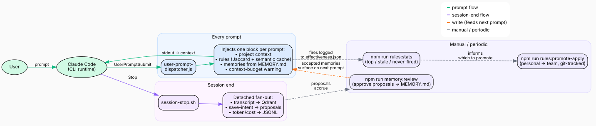
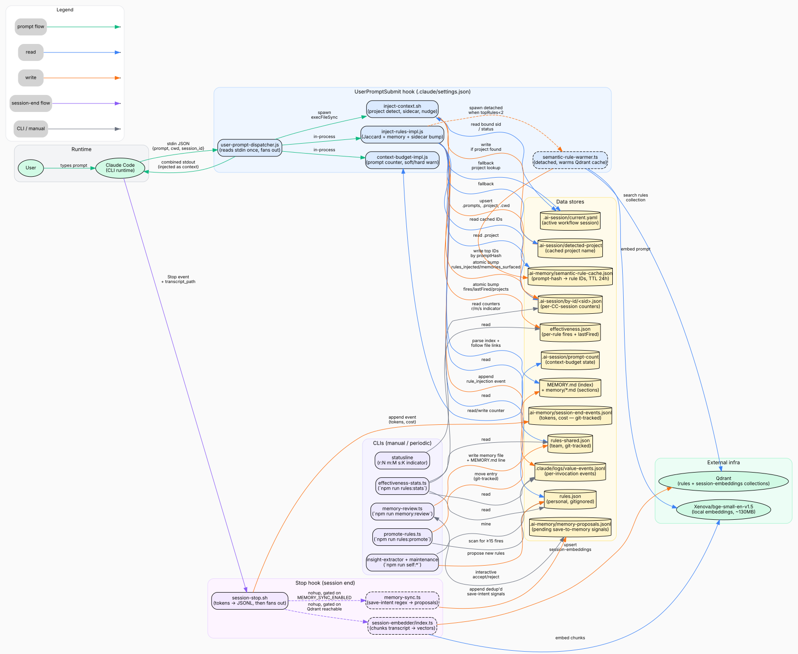

# Prompt / Hook / Rules / Learning System — End to End

This is the reference diagram for how a single user prompt flows through the
hook chain, how rules and memories get injected, and how the learning loop
feeds back into the corpus.

## Overview (start here)



Three loops make up the system:

1. **Every prompt** → `user-prompt-dispatcher.js` fans out to project-context,
   rule-injection, MEMORY.md section injection, and context-budget. Emits one
   combined stdout block that Claude Code picks up as additional context.
2. **Session end** → `session-stop.sh` detached-spawns the transcript embedder
   and the memory-save-signal extractor. Never blocks session close.
3. **Manual / periodic** → `rules:stats`, `memory:review`, `rules:promote-apply`
   close the human-in-the-loop and feed cleaned signals back into rules /
   MEMORY.md, which the next prompt can surface.

Source: [`prompt-hook-learning-system-overview.dot`](prompt-hook-learning-system-overview.dot)

## Detailed view (all data stores and edges)



- **Source:** [`prompt-hook-learning-system.dot`](prompt-hook-learning-system.dot) — edit the DOT, re-render.
- **Re-render both diagrams:**
  ```bash
  for name in prompt-hook-learning-system prompt-hook-learning-system-overview; do
    dot -Tsvg  docs/architecture/$name.dot -o docs/architecture/$name.svg
    dot -Tpng -Gdpi=150 docs/architecture/$name.dot -o docs/architecture/$name.png
  done
  ```

## What each color means

| Color | Meaning |
|---|---|
| 🟢 Green | Prompt flow — user → Claude Code → hooks → back to context |
| 🔵 Blue | Data read |
| 🟠 Orange | Data write |
| 🟣 Purple | Session-end (Stop hook) flow |
| ⚪ Gray | Manual / periodic CLI |

## The three loops

### 1. Prompt loop (fires on every user turn)

`UserPromptSubmit` in `.claude/settings.json` points at
[`user-prompt-dispatcher.js`](../../scripts/hooks/user-prompt-dispatcher.js).
The dispatcher reads stdin once and produces a single combined output block:

1. `inject-context.sh` — runs via `execFileSync`; maintains the per-session
   sidecar (`.ai-session/by-id/<sid>.json`), resolves the active project
   (4 source fallback), emits `<project-context>` + `<no-active-session>`
   banners.
2. [`inject-rules-impl.js`](../../scripts/hooks/inject-rules-impl.js) — runs
   in-process; tokenizes the prompt, Jaccard-scores rules from both
   `rules-shared.json` (team) and `rules.json` (personal), applies a
   project + team boost, and picks the top 5. If the top rules are thin
   (<2), reads [`.ai-memory/semantic-rule-cache.json`](../../.ai-memory/) for
   semantic-cache hits and spawns the **warmer** detached to refresh cache
   for next time. Also parses `MEMORY.md` + linked `memory/*.md` files and
   surfaces the best-matching section under a separate
   `[N memories surfaced from MEMORY.md]` block.
3. `context-budget-impl.js` — runs in-process; bumps
   `.ai-session/prompt-count`, emits a soft warn every 30 prompts, strong
   warn every 10 prompts above 50.

All three impls write back:
- **Effectiveness** counters per rule (`effectiveness.json`) and per
  invocation (`value-events.jsonl`).
- **Sidecar** counters (`rules_injected`, `memories_surfaced`,
  `semantic_cache_hits`) so the statusline and `rules:stats` can show
  "this session".

Budget: p95 observed ≈ **80-100 ms** (timeout is 3000 ms in `settings.json`).

### 2. Semantic fallback loop (triggers when lexical is sparse)

[`semantic-rule-warmer.ts`](../../scripts/hooks/semantic-rule-warmer.ts) runs
detached (stdio: ignore) — zero latency impact on the prompt hook:

1. Embeds the prompt via `Xenova/bge-small-en-v1.5` (local, ~130 MB model,
   cached in `~/.cache/huggingface/`).
2. Queries the Qdrant `rules` collection via `searchRules()` in
   [`qdrant-client.ts`](../../scripts/self-improvement/qdrant-client.ts).
3. Writes top-N rule IDs keyed by a 16-char prompt hash into
   `.ai-memory/semantic-rule-cache.json` (TTL 24h, max 256 entries).

The NEXT prompt with the same (lemmatized-tokens-sorted) hash pulls from
the cache and emits `match: lexical+semantic-cache` in its output prefix.

Toggle: `QDRANT_RULES_SEARCH=0` to disable.

### 3. Learning loop (fires on session end)

`Stop` in `.claude/settings.json` triggers
[`session-stop.sh`](../../scripts/hooks/session-stop.sh), which:

1. Sums transcript `message.usage` blocks and appends a token/cost row to
   `.ai-memory/session-end-events.jsonl` (git-tracked — team reports).
2. If Qdrant is reachable, fires `session-embedder/index.ts` detached to
   chunk the transcript into the `session-embeddings` collection.
3. If `MEMORY_SYNC_ENABLED!=0`, fires
   [`memory-sync.ts`](../../scripts/hooks/memory-sync.ts) detached —
   regex-scans user turns for explicit save-intent phrases
   (`save to memory`, `remember this`, `note for later`, etc.) and appends
   deduplicated proposals (paired with the preceding assistant turn) to
   `.ai-memory/memory-proposals.jsonl`.

Human review closes the loop: `npm run memory:review` walks the proposal
queue and optionally writes a `memory/<slug>.md` file plus a `MEMORY.md`
index line. `npm run rules:promote-apply` moves personal rules with ≥15
fires into `rules-shared.json` (git-tracked, shared with the team).

### `rules.json` is personal and local-only

`scripts/self-improvement/rules.json` is **gitignored and untracked** — it
holds *your* extracted rules and never gets committed. The only path to the
team is promotion: `rules:promote-apply` → `rules-shared.json`, which you
commit manually. The self-improve scripts respect this — `gitCommit()` in
`proposal-manager.ts` skips gitignored files (via `git check-ignore`) instead
of force-adding them, and the prune/consolidate steps no longer commit
`rules.json` at all.

## How to debug a missing injection

1. **Did the hook fire?** Run the dispatcher manually:
   ```bash
   echo '{"prompt":"<your prompt>","cwd":"'"$PWD"'","session_id":"test"}' \
     | node ./scripts/hooks/user-prompt-dispatcher.js
   ```
   Nothing? → something crashed silently. Check each impl:
   ```bash
   node ./scripts/hooks/inject-rules.js < /tmp/hook-input.json
   node ./scripts/hooks/context-budget.js < /tmp/hook-input.json
   ```
2. **Did any rule cross the threshold?** Look at the output prefix. No
   `[N rules injected …]` header → Jaccard < 0.02 for every rule. Either
   the prompt is too terse (stopword-filtered tokens < 3) or the corpus
   truly has nothing relevant.
3. **Did project detection succeed?** `project: <name>` in the prefix.
   Absent? → check `.ai-session/by-id/<current-sid>.json .project` and
   `.ai-session/current.yaml task.project`.
4. **Should semantic have fired?** Only runs when topRules.length < 2.
   Check `.ai-memory/semantic-rule-cache.json` — if empty, Qdrant is
   down or the warmer hasn't had time to populate. The cache only helps
   on the SECOND similar prompt.
5. **Are memories surfacing?** `INJECT_MEMORY_SECTIONS=0` disables them.
   Otherwise they follow the same Jaccard scoring against parsed sections
   of `~/.claude/projects/<encoded>/memory/MEMORY.md`.

## Reading the stats

`npm run rules:stats` aggregates:

- **Corpus** — active vs. total rules, how many have ever fired.
- **Injection events** — total invocations, average rules per invocation,
  lexical-vs-semantic mix, top projects.
- **Top N rules by fires** — the workhorses.
- **Fires by category** — where your learning is concentrated.
- **Stale** — rules that fired once but haven't in 60+ days.
- **Never fired** — rules that never earned their keep.

Use `--json` for tooling, `--since YYYY-MM-DD` to window, `--limit N` for
top-N depth.

## When to update this diagram

Edit [`prompt-hook-learning-system.dot`](prompt-hook-learning-system.dot) and
re-render whenever you:

- Change the shape of `.claude/settings.json` hooks.
- Add a new data store under `.ai-session/`, `.ai-memory/`, or `scripts/self-improvement/`.
- Introduce a new CLI entry point under `scripts/hooks/` or `scripts/self-improvement/`.
- Rewire what's read/written by a hook (boost confidence by coloring the edge
  correctly — blue for read, orange for write, purple for session-end fan-out).
